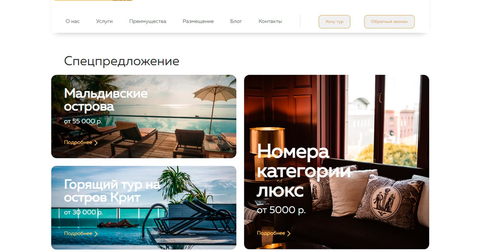

ГОСУДАРСТВЕННОЕ БЮДЖЕТНОЕ ОБРАЗОВАТЕЛЬНОЕ УЧРЕЖДЕНИЕ ГОРОДА МОСКВЫ ДОПОЛНИТЕЛЬНОГО ПРОФЕССИОНАЛЬНОГО ОБРАЗОВАНИЯ ЦЕНТР ПРОФЕССИОНАЛЬНЫХ КВАЛИФИКАЦИЙ И СОДЕЙСТВИЯ ТРУДОУСТРОЙСТВУ «ПРОФЕССИОНАЛ»

ПОЯСНИТЕЛЬНАЯ ЗАПИСКА
к итоговой аттестационной работе на тему
«Разработка web-ресурса с использованием технологий HTML, CSS, JavaScript, jQuery, PHP»
(на примере web-ресурса: http://cheyne.p-host.in/

слушателя Снитко Ивана Валерьевича группы №: 0667
программы профессиональной переподготовки
«Frontend разработка»

Москва, 2022

Оглавление

ПОСТАНОВКА ЗАДАЧИ И ПЛАН РАБОТЫ. 3
ОСНОВНАЯ ЧАСТЬ. 4
НАЗНАЧЕНИЕ ВЕБ-РЕСУРСА. 4
ОПИСАНИЕ ЭТАПОВ РАЗРАБОТКИ, ОПИСАНИЕ ФУНКЦИОНАЛА С ПРИЛОЖЕНИЕМ ЛИСТИНГОВ ИСХОДНОГО ПРОГРАММНОГО КОДА ОСНОВНОЙ ФУНКЦИИ, СТРУКТУРНЫХ МОДУЛЕЙ, ПРИМЕР КОДА-РАЗМЕТКИ 4
СПИСОК ЛИТЕРАТУРЫ 11

ПОСТАНОВКА ЗАДАЧИ И ПЛАН РАБОТЫ.

Задачей являлось создание веб-ресурса для самопрезентации в интернете. Перед началом работы над проектом необходимо определиться какой будет внешний вид сайта.
Задачи к наполнению сайта: контактные данные, виды выполняемых услуг, примеры работ, форма заявки, различные способы связи.
План работ:

1. Подключение фреймворка Bootstrap.
2. Подключение иконочных шрифтов от Google Fonts.
3. Адаптивная верстка страницы сайта.
4. Интерактивные способы связи.
5. Создание анимации.
6. Создание формы заявки с отправкой на электронную почту.

ОСНОВНАЯ ЧАСТЬ.
Назначение веб-ресурса.

Веб-ресурс предназначен для предоставления информации потенциальным клиентам о видах предоставляемых услуг.

Описание этапов разработки, описание функционала с приложением листингов исходного программного кода основной функции, структурных модулей, пример кода-разметки

Этап разработки начинался с создания проекта с использованием фреймворка Bootstrap ver 4.6 (далее “фреймворк”). Перед началом работы над проектом необходимо подключить фреймворк.

Иконочные шрифты

<link
      href="https://fonts.googleapis.com/icon?family=Material+Icons"
      rel="stylesheet"
    />

Листинг 1.

Веб ресурс создавался с использованием системы сеток фреймворка “Container”, “Col-md”, “Flexbox” а также дополнительных готовых компонентов фреймворка.

В проект веб ресурса входят: 1 страница в формате html, 1 страница в формате CSS, 1 страница в формате JS и 1 страница в формате php. Помимо них в проект входит папка с изображениями. Страница веб проекта адаптивная и кросс-браузерная и может открываться на разных устройствах с разным разрешением экрана.
При переходе по адресу http://cheyne.p-host.in/ пользователь попадает на страницу сайта, в шапке которой расположено меню для перехода на другие разделы веб ресурса и интерактивный номер телефона с анимацией.

<header class="header">
      

        <nav class="navbar navbar-expand-md navbar-light">
          <a class="navbar-brand logo" href="/">&lt;N/D&gt;</a>
          <button
            class="navbar-toggler"
            type="button"
            data-toggle="collapse"
            data-target="#navbarNav"
            aria-controls="navbarNav"
            aria-expanded="false"
            aria-label="Переключатель навигации"
          >
            
          </button>
          

            <ul class="navbar-nav">
              <li class="nav-item">
                <a class="nav-link" href="#services">Услуги</a>
              </li>
              <li class="nav-item">
                <a class="nav-link" href="#portfolio">Портфолио</a>
              </li>
              <li class="nav-item">
                <a class="nav-link" href="#price">Цены</a>
              </li>
            </ul>
            <a href="tel:+79067075235" class="header-tel">
              
              
              
              
              +7(906)707-52-35
            </a>
          

        </nav>
      

    </header>

Листинг 2.
На основной странице расположен блок с датой и временем, который в мобильной версии исчезает.

let r;
Number.prototype.pad = function (n) {
for (r = this.toString(); r.length < n; r = 0 + r);
return r;
};

function updateClock() {
let now = new Date();
let min = now.getMinutes(),
hour = now.getHours(),
month = now.getMonth(),
day = now.getDate(),
year = now.getFullYear();
let months = [
"Января",
"Февраля",
"Марта",
"Апреля",
"Мая",
"Июня",
"Июля",
"Августа",
"Сентября",
"Октября",
"Ноября",
"Декабря",
];
let tags = ["mon", "d", "y", "h", "m"],
corr = [months[month], day, year, hour.pad(2), min.pad(2)];
for (let i = 0; i < tags.length; i++)
document.getElementById(tags[i]).firstChild.nodeValue = corr[i];
}

function initClock() {
updateClock();
window.setInterval("updateClock()", 1);
}

Листинг 3.
С помощью CSS псевдокласса hover, псевдоэлемента not(:last-child) и свойств стилей CSS, зафиксировал формы связи через мессенджеры Telegram, WhatsApp и электронную почту, которые при наведении выдвигаются.
.social-list {
position: fixed;
left: 0;
top: 40%;
z-index: 10;
}
.social-list li {
margin-left: -105px;
transition: all 0.3s ease-in-out;
}
.social-list li:hover {
margin-left: 0;
}
.social-list li a {
position: relative;
display: inline-block;
border-radius: 0 5px 5px 0;
padding: 10px;
box-shadow: 0 0 3px rgba(255, 255, 255, 0.5);
color: #fff !important;
font-size: 20px;
width: 150px;
}
.social-list li:not(:last-child) {
margin-bottom: 10px;
}
.social-list li a img {
position: absolute;
right: 10px;
top: 14px;
text-align: right;
}
Листинг 4.

В веб ресурсе представлена краткая информация о предоставляемых услугах, сроках и стоимости работ.

Листинг 4.

При помощи фреймворка bootstrap v.4.6 была добавлена карусель выполненных работ с автоматическим и ручным переключением слайдов.

 

        

          

            
          

          

            
          

          

            
          

        

        <a
          class="carousel-control-prev"
          href="#carouselExampleInterval"
          role="button"
          data-slide="prev"
        >
          
          Предыдущий
        </a>
        <a
          class="carousel-control-next"
          href="#carouselExampleInterval"
          role="button"
          data-slide="next"
        >
          
          Следующий
        </a>
      

Листинг 5.
При помощи PHP была добавлена форма заявки, которая отправляет на электронную почту данные с именем, электронной почтой и текстовым запросом.

<?php

$recepient = "nice-dev@list.ru";
$subject = "Заявка с сайта";
$headers .= "Content-type: text/html; charset=utf-8\r\n";
$headers .= "From: Заявка с сайта <test.ru>\r\n";

$name = trim($_POST['name']);
$email = trim($_POST['email']);
$message = trim($_POST['message']);

$text = "Имя: $name   E-mail: $email   Сообщение: $message";

mail($recepient, $subject, $text, $headers);
Листинг 6.

Исходные файлы проекта можно просмотреть на GitHub по ссылке: https://github.com/ivan-niceman/visit-card 
Тестирование работоспособности веб ресурса проводилось не в автоматическом режиме, т.е. без написания тестов. 
 

СПИСОК ЛИТЕРАТУРЫ

1. Электронные ресурсы. 
1.  Сайт 
Документация по фреймворку Bootstrap на русском языке [Электронный ресурс]: офиц. сайт. URL: https://bootstrap-4.ru/ (Дата обращения: 25.08.2022).
2. Сайт 
Официальная документация ресурса GoogleFonts [Электронный ресурс]: офиц. сайт. URL: https://fonts.google.com/(Дата обращения: 25.08.2022).
3.  Сайт
Электронный учебник по HTML и CSS [Электронный ресурс]: офиц. сайт. http://htmlbook.ru/html5 (Дата обращения: 25.08.2022).
5. Сайт
Официальная документация Mozilla [Электронный ресурс]: офиц. сайт. URL: https://developer.mozilla.org/ru/ (Дата обращения: 25.08.2022).
